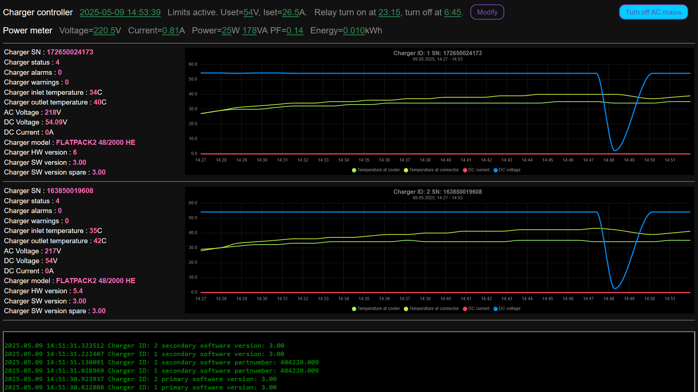

# flatpack2ctl

Project goal is adapt Eltek flatpack2 charger to 48V LiFePO4 home battery.

Eltek flatpack2 is industrial telecom battery charger with digital control via CAN bus line.

Pay attention to charger connector PCB. Long charging sessions with full charger power can damage connector.
Gold plated charger connector PCB is strongly required. Or solder wires direct to charger PCB as i did.

Done:
* PCBv1 - for testing
* AC mains control for cheap night charge
* Chart with current, voltage, temperature
* Limit charger current
* Set charger default voltage
* HTML GUI
* telnet connection with console commands. Type "help" to see all available commands
* PCBv2 - add power meter, do pin compatible with liliGO T-CAN485.
* Add power meter readings to GUI

To do:
* PCBv3 rearrange con.

It was SD360 flux. 
> Unresolved:
> 
> I have five flatpack2 chargers with SN:
> * 183371037950 'FLATPACK2 48/2000 HE B-F' HW:4 SW:1.02/2.00
> * 145172008395 'FLATPACK2 48/2000 HE' HW:4 SW:2.00/2.00
> * 172650024173 'FLATPACK2 48/2000 HE' HW:6 SW:3.00/3.00
> * 163850019608 'FLATPACK2 48/2000 HE' HW:5.4 SW:3.00/3.00
> * 192750001639 'FLATPACK2 48/2000 HE' HW:9 SW:4.01/4.00

> Only two last simultaneously communicate with smartpack2 master and my flatpack2ctl.
> Any other pair (or more) communicate only one charger, others stays silent.
> That could be CAN passive state. Silent charger detects CAN errors and turn off CAN.
> But LED indication shows no errors, only green LED is on.

